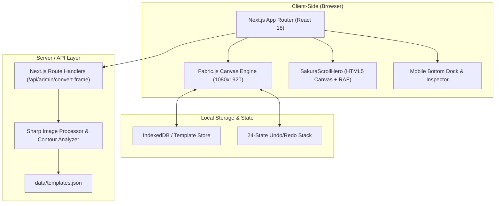

<div align="center">

# 🌸 TempTree · 桜の物語
### *Curated Aesthetic Instagram Story Templates & In-Browser Visual Editor*

[](https://nextjs.org/)
[](https://www.typescriptlang.org/)
[](https://tailwindcss.com/)
[](http://fabricjs.com/)
[](https://sharp.pixelplumbing.com/)
[](LICENSE)

<p align="center">
  <b>Discover aesthetic Instagram Story frames across Y2K, Minimal, Dreamy, Vintage, and Bold themes.</b><br/>
  Customize photo slots directly in-browser with precision snapping and export ready-to-post 1080×1920 visuals in seconds.
</p>

[Explore Templates](http://localhost:3000/#gallery) · [How It Works](http://localhost:3000/#how-it-works) · [Features](#-key-features) · [CLI Tool](#-automated-frame-conversion-cli) · [Getting Started](#-getting-started)

</div>

---

## 📖 Table of Contents
- [Overview](#-overview)
- [Why TempTree?](#-why-temptree)
- [Key Features](#-key-features)
  - [1. Cinematic Sakura Scroll Hero](#1-cinematic-sakura-scroll-hero)
  - [2. Interactive In-Browser Slot Editor](#2-interactive-in-browser-slot-editor)
  - [3. Automated Frame Detection & Cutout Engine](#3-automated-frame-detection--cutout-engine)
  - [4. Seamless Mobile & Desktop Experience](#4-seamless-mobile--desktop-experience)
  - [5. Privacy-First & Zero Sign-Up](#5-privacy-first--zero-sign-up)
- [Brand Identity & Design System](#-brand-identity--design-system)
- [Architecture & Tech Stack](#-architecture--tech-stack)
- [Project Directory Structure](#-project-directory-structure)
- [Getting Started](#-getting-started)
- [Keyboard Shortcuts Cheat Sheet](#-keyboard-shortcuts-cheat-sheet)
- [Automated Frame Conversion CLI](#-automated-frame-conversion-cli)
- [Roadmap](#-roadmap)
- [Contributing & License](#-contributing--license)

---

## 🌸 Overview

**TempTree** (桜の物語) is a curated, aesthetic-first web studio created specifically for crafting stunning Instagram Stories. 

Existing design tools (such as Canva or generic template aggregators) are often cluttered with corporate branding, complex dashboards, multi-step subscriptions, or non-cohesive aesthetic styles. TempTree solves this by narrowing its focus strictly to the **aesthetic story niche**:
- Clean categories: **Y2K**, **Minimal**, **Dreamy**, **Vintage**, and **Bold**.
- Pixel-perfect **1080×1920** story coordinate canvas.
- No mandatory accounts, no watermarks, no bloated toolbars.
- Go from landing page to chosen aesthetic template to exported story in under **60 seconds**.

---

## ⚡ Why TempTree?

| Traditional Template Editors | TempTree (桜の物語) |
|---|---|
| Cluttered dashboards with corporate presentation tools | Curated strictly for Instagram Stories & mobile aesthetic media |
| Complex multi-layered menus and hidden controls | Direct-manipulation canvas with floating slot badges & quick hotkeys |
| Requires account registration & cloud sync delay | 100% free, zero login required, client-side photo processing |
| Generic templates with disjointed color palettes | Unified Sakura & dreamy aesthetic palette across the entire experience |
| Manual image cropping and tedious slot alignments | Automatic cover-scale zoom clamping, magnetic snapping, & frame detection |

---

## ✨ Key Features

### 1. Cinematic Sakura Scroll Hero
- **Smooth Scroll-Scrubbed Canvas**: 150-frame pre-rendered sequence capturing an aerial descent through cherry blossom petals into a low-angle orbit around a blooming sakura tree.
- **Hardware-Accelerated Decoding**: Leverages `createImageBitmap()` and RequestAnimationFrame (RAF) throttling for 60 FPS scrubbing without GPU overhead.
- **100% Readiness Preloader Gatekeeper**: Employs an intelligent 12-worker image pool with an aesthetic blossom progress indicator, ensuring zero animation lag or stutter.
- **Dedicated Mobile Atmosphere**: Lightweight CSS-driven atmospheric blossom background on mobile devices (<768px) to preserve battery and maintain instant response times.

### 2. Interactive In-Browser Slot Editor
- **1080×1920 Story Space**: Native high-resolution vertical canvas powered by an optimized [Fabric.js](http://fabricjs.com/) engine.
- **Numbered Slot Badges (①, ②, ③)**: Dynamic floating badges pinned to each photo slot's corner in screen space. Click any badge to immediately focus and tweak that slot.
- **In-Slot Bounded Zoom**: Scroll wheel and touch pinch zooming clamped to `Math.max(slotW/imgW, slotH/imgH)` up to 4.5×. Photos remain pinned within their frame borders without ever exposing empty clipping gaps.
- **Rotated Polaroid Hit-Testing**: Drag-and-drop photos straight from your desktop onto any slot. Hit-testing runs through an inverse rotation matrix ($\theta$), making polaroid-tilted slots effortless to fill.
- **Magnetic Snapping Guides**: Automatic snapping for Canvas Center ($X=540, Y=960$), sibling slot alignments, and 45°/90° rotation snapping with visual dashed alignment guidelines.
- **Desktop Numeric Coordinates Inspector**: Full numeric input card for `Width`, `Height`, `Center X`, `Center Y`, `Rotation Angle`, and `Corner Radius`.
- **Corner Radius Control**: Smooth $0–80\text{px}$ slider with presets (`Sharp 0px`, `Soft 24px`, `Pill 80px`), live-synced to Fabric `clipRect` and cropper previews.
- **Aspect Ratio Locking**: Quick presets (`Free`, `1:1`, `4:5`, `9:16`, `3:4`, `16:9`) with proportional scaling lock.
- **24-Step Undo / Redo Pipeline**: Full history snapshot management tracking nudges, adjustments, and photo swaps with header buttons and `Ctrl+Z` / `Ctrl+Y` shortcuts.

### 3. Automated Frame Detection & Cutout Engine
- **Computer Vision Frame Detection**: Upload any graphic frame image, moodboard, or polaroid collage. The backend analyzer ([Sharp](https://sharp.pixelplumbing.com/)) automatically locates solid flat-color openings (black, green, maroon, white, etc.).
- **Smart Background Rejection**: Filters out decorative borders and full-bleed backgrounds by aspect ratio and coverage thresholds.
- **Automatic PNG Punching**: Creates a transparent cutout overlay frame PNG stored in `/public/frames/`.
- **Visual Detection Review (Gallery)**:
  - Interactive draggable bounding boxes directly on top of the preview frame.
  - Bottom-right corner resize handles (`cursor-se-resize`).
  - One-click slot duplication (`Copy` button) to generate offset clones for collages.
  - Inline slot renaming synced into the editor session.

### 4. Seamless Mobile & Desktop Experience
- **Touch Target Accessibility**: Audited and calibrated interactive controls meeting the $\ge 44\times44\text{px}$ mobile accessibility standard.
- **Thumb-Friendly Bottom Dock**: Clean mobile dock for selecting slots, swapping photos, adjusting framing, and triggering exports.
- **Mobile Export Flow**: Modal layout preventing viewport overflow, offering high-res download and native file sharing.
- **How It Works 3D Stepper**: Interactive journey steps with mobile-safe 3D perspective transforms to prevent horizontal page wiggles.

### 5. Privacy-First & Zero Sign-Up
- All photo manipulation, cropping, canvas rendering, and exports happen locally inside the user's browser.
- Your personal photos are **never uploaded to external cloud storage** or tracked across sessions.

---

## 🎨 Brand Identity & Design System

The visual design language of TempTree mirrors the natural tones of blooming cherry blossoms, transitioning gracefully from dark atmospheric depths to soft, radiant gallery whites.

### The Sakura Palette

```
  Charcoal       Plum Dark      Dusty Mauve    Peach Pink     Blush Cream
  #4A4A4A        #181116        #E2B4BD        #F7D6D0        #FFF5F5
   [   ]          [   ]          [   ]          [   ]          [   ]
 Primary Text    Background      Accents        Highlights    Canvas Base
```

| Token | Hex | Usage |
|---|---|---|
| **Charcoal** | `#4A4A4A` | Primary typography, deep chrome borders, high-contrast labels |
| **Plum Dark** | `#181116` | Deep atmospheric background, canvas matte, header chrome |
| **Dusty Mauve** | `#E2B4BD` | Primary CTA buttons, active slot indicators, category chips |
| **Peach Pink** | `#F7D6D0` | Hover outlines, active badges, magnetic guidelines, accents |
| **Blush Cream** | `#FFF5F5` | Canvas background, light framing, crisp modal text |

### Typography
- **Wordmark & Headings**: `Playfair Display` (Google Fonts) — timeless, editorial serif capturing elegance and warmth.
- **UI Chrome & Canvas**: `Poppins` (Google Fonts) — clean, geometric, high-legibility sans-serif for controls and inputs.

---

## 🏗️ Architecture & Tech Stack



- **Framework**: [Next.js 14](https://nextjs.org/) (App Router, React 18, React Server Components)
- **Language**: [TypeScript 5.6](https://www.typescriptlang.org/)
- **Canvas Rendering**: [Fabric.js 5.3](http://fabricjs.com/)
- **Image Processing**: [Sharp 0.35](https://sharp.pixelplumbing.com/)
- **Animations & Smooth Scrolling**: [Framer Motion](https://www.framer.com/motion/), [GSAP](https://gsap.com/), and [Lenis](https://lenis.darkroom.engineering/)
- **Styling**: [Tailwind CSS 3.4](https://tailwindcss.com/) with custom CSS variables
- **Icons**: [Lucide React](https://lucide.dev/)

---

## 📁 Project Directory Structure

```text
temptree/
├── app/
│   ├── layout.tsx                     # Root HTML layout with Playfair & Poppins fonts
│   ├── page.tsx                       # Homepage (Sakura hero, showcase, stepper, bento)
│   ├── editor/[templateId]/page.tsx   # Core in-browser Story Editor
│   ├── gallery/page.tsx               # Template discovery & visual frame converter
│   ├── upload-template/page.tsx       # Creator frame-upload flow
│   ├── api/admin/convert-frame/       # Sharp automated placeholder detection endpoint
│   ├── privacy/ & terms/              # Legal and privacy policy pages
│   └── globals.css                    # Tailwind root directives and animations
├── components/
│   ├── SakuraScrollHero.tsx           # Desktop 300-frame canvas scroll scrubbing engine
│   ├── MobileSakuraHero.tsx           # Lightweight mobile atmospheric hero
│   ├── TemplateCanvas.tsx             # Fabric.js story canvas with badges & guidelines
│   ├── HowItWorksStepper.tsx          # 3-step interactive journey with 3D perspective
│   ├── ShowcaseReveal.tsx             # Interactive before/after split slider
│   ├── FeaturesBento.tsx              # Bento grid of core product capabilities
│   ├── ImageCropperModal.tsx          # Precision photo framing & corner radius modal
│   ├── MobileExportModal.tsx          # Thumb-reachable mobile export dialog
│   └── TemplateDesignGuidelines.tsx   # In-app frame authoring guidelines
├── data/
│   └── templates.json                 # Template catalog (elements, slots, coordinates)
├── docs/
│   ├── PRD.md                         # Product Requirements Document
│   ├── DESIGN.md                      # Aesthetic specifications & animation timings
│   ├── TECH-STACK.md                  # Architectural decisions & considerations
│   └── TEMPLATE-WORKFLOW.md           # Template authoring & curation guide
├── lib/
│   ├── frame-converter.ts             # Sharp contour detection & cutout generator
│   └── template-store.ts              # IndexedDB persistence layer
├── public/
│   ├── frames/                        # Cutout frame PNG assets
│   ├── previews/                      # High-res template thumbnails
│   └── sakura-frames/                 # Compressed 150-frame WebP hero sequence
├── scripts/
│   ├── convert-frame-template.mjs     # Standalone CLI for frame conversion
│   └── convert-frames-to-webp.mjs     # Frame sequence optimization script
└── types/
    └── template.ts                    # TypeScript definitions for templates & layouts
```

---

## 🚀 Getting Started

### Prerequisites
- **Node.js**: `v18.17.0` or higher
- **Package Manager**: `npm` (v9+) or `pnpm`

### Installation

1. **Clone the repository**:
   ```bash
   git clone https://github.com/aftab125-del/TempTree.git
   cd TempTree
   ```

2. **Install dependencies**:
   ```bash
   npm install
   ```

3. **Start the local development server**:
   ```bash
   npm run dev
   ```
   Open [http://localhost:3000](http://localhost:3000) in your browser.

4. **Build for production**:
   ```bash
   npm run build
   npm run start
   ```

---

## ⌨️ Keyboard Shortcuts Cheat Sheet

TempTree features a full suite of power-user hotkeys in the Story Editor:

| Shortcut | Action |
|---|---|
| <kbd>1</kbd> – <kbd>9</kbd> | Quick-select photo slot by numerical index |
| <kbd>Arrow Keys</kbd> | Nudge selected slot position by **1px** |
| <kbd>Shift</kbd> + <kbd>Arrow Keys</kbd> | Nudge selected slot position by **10px** |
| <kbd>[</kbd> and <kbd>]</kbd> | Rotate slot tilt angle by **-1° / +1°** |
| <kbd>Shift</kbd> + <kbd>[</kbd> / <kbd>]</kbd> | Rotate slot tilt angle by **-5° / +5°** |
| <kbd>Scroll Wheel</kbd> / <kbd>Pinch</kbd> | Zoom photo within slot (clamped to cover) |
| <kbd>Ctrl</kbd> + <kbd>Z</kbd> | Undo last geometry or photo change |
| <kbd>Ctrl</kbd> + <kbd>Y</kbd> | Redo change |
| <kbd>Enter</kbd> | Confirm and commit slot adjustment |
| <kbd>Esc</kbd> | Cancel adjust mode / close modal dialog |
| <kbd>?</kbd> | Open Keyboard Shortcuts help modal |

---

## 🛠️ Automated Frame Conversion CLI

Transform any custom graphic frame (PNG, JPG, WebP) with solid placeholder regions into an editable TempTree template recipe:

```bash
npm run convert:frame -- <path-to-image> [options]
```

### CLI Flags & Arguments

```bash
npm run convert:frame -- ./my-frame.png \
  --id="vintage-polaroid-story" \
  --name="Vintage Polaroid Collage" \
  --category="Vintage" \
  --variance=15 \
  --min-width=160 \
  --min-height=180
```

- `--variance=<number>`: RGB variance tolerance for flat-color scanning (default: `15`).
- `--category=<category>`: One of `Y2K`, `Minimal`, `Dreamy`, `Vintage`, `Bold` (default: `Minimal`).
- `--min-width=<number>`: Minimum slot width in pixels (default: `160`).
- `--min-height=<number>`: Minimum slot height in pixels (default: `180`).
- `--detect-plus=<true|false>`: Detect optional `+` add-photo glyphs at region center (default: `true`).

---

## 🗺️ Roadmap

- [x] **Phase 1**: Responsive Sakura scroll-scrubbing hero animation.
- [x] **Phase 2**: Multi-category live template gallery (Y2K, Minimal, Dreamy, Vintage, Bold).
- [x] **Phase 3**: 1080×1920 Fabric.js story editor with floating badges & cover zooming.
- [x] **Phase 4**: Automated Sharp-based frame conversion engine with visual review.
- [x] **Phase 5**: Touch target audit, mobile dock, and mobile export modal.
- [ ] **Phase 6**: 4K Ultra-HD Story export option (2160×3840, 2× retina scale).
- [ ] **Phase 7**: In-canvas typography editor with curated Google Font aesthetic pairings.
- [ ] **Phase 8**: Aesthetic sticker library (sakura petals, washi tape, stamps, and paper clips).
- [ ] **Phase 9**: Optional cloud sync via Supabase for multi-device template libraries.

---

## 🤝 Contributing & License

Contributions, feedback, and template designs are welcome! Feel free to open an [Issue](https://github.com/aftab125-del/TempTree/issues) or submit a Pull Request.

This project is licensed under the **MIT License**.

<div align="center">
  <sub>Crafted with care for aesthetic storytellers · TempTree © 2026</sub>
</div>
