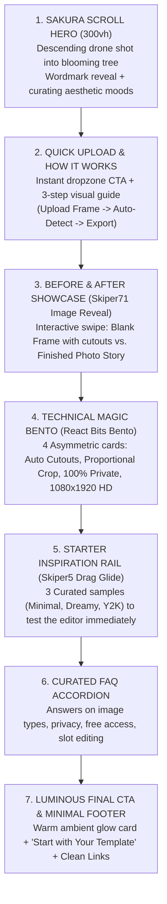

# TempTree — Homepage Design & UI Architecture Plan
**Document:** `docs/HOMEPAGE-DESIGN-PLAN.md`  
**Status:** Under Review (Planning & Research Phase — No Code Modified)  
**Author:** AI Pair Programmer & TempTree Design Architecture  

---

## Executive Summary & Product Alignment

TempTree has pivoted from a browsable, curated template library into an **Upload-and-Edit utility for aesthetic Instagram Stories**. 

* **The Core Value Loop:** Upload any frame/moodboard image $\rightarrow$ Auto-detect transparent photo placeholder slots $\rightarrow$ Insert personal photos with proportional cropping $\rightarrow$ Export 1080×1920 HD PNG.
* **No Accounts / No Cloud Storage:** Instant client-side utility with zero sign-up friction.
* **The Centerpiece:** A high-performance, 300-frame scroll-scrubbing Sakura hero animation that establishes the atmospheric tone (soft, moody-to-dreamy cherry blossom aesthetic).
* **The Goal of this Plan:** Determine what comes *after* the Sakura hero concludes, how sections transition into each other, which component patterns and micro-interactions elevate the user experience, and how to avoid the trap of turning a lightweight consumer tool into a cluttered B2B SaaS page.

---

## 1. Research Synthesis: Three Resources Evaluated

### Resource 1: React Bits (`reactbits.dev` & `pro.reactbits.dev/docs/blocks/`)
* **Core Strengths:** Modular, copy-paste Tailwind + Framer Motion blocks with strong typographic hierarchy, spotlight card shaders (`SpotlightCard`), bento layouts, step flows, and clean FAQ accordions.
* **Best Fits for TempTree:**
  * **How It Works:** Sequential step container with connecting milestone lines, numbered indicator badges, and visual micro-previews.
  * **Bento Grid:** Asymmetric 4-card layout with subtle border illumination and high-contrast typography to explain the tech without technical jargon.
  * **FAQ:** Clean accordion with soft border transitions and subtle background hover highlights matching TempTree's palette.
  * **Final CTA:** Atmospheric floating card with subtle mauve/peach radial backdrop glow and clean button hierarchy.

### Resource 2: Skiper UI (`skiper-ui.com`)
* **Core Strengths:** Built directly on shadcn/ui + Tailwind + Motion.dev (identical to our stack). Renowned for tactile, refined micro-interactions (e.g. `skiper71` Image Reveal, `skiper5` Drag-and-Scroll, `skiper43` Vercel-style Tooltips, and `skiper31` 3D Perspective Scroll Typography).
* **Best Fits for TempTree:**
  * **`skiper71` Image Reveal (Split Slider / Hover Reveal):** Perfect for the Showcase section to reveal the user's filled photo story underneath the raw detected frame.
  * **`skiper5` Drag-and-Scroll / Momentum Glide:** Ideal for horizontal browsing of the 3 starter inspiration templates on both mobile and desktop.
  * **Tactile Spring Micro-Interactions:** Subtle button click states (`whileTap={{ scale: 0.97 }}`), dropzone border expansion on drag-over, and tooltip cues on interactive slots.

### Resource 3: ThreeUI Kage Landing Page (`threeui.com/landing-pages/kage-landing-page`)
* **Core Strengths:** A 5-chapter atmospheric night walk through a Kyoto mountain temple by Meng To. Benchmark for scroll-scene choreography, sticky camera progression, and layered foreground typography that enters, holds, and exits based on scroll thresholds.
* **Core Choreography Lessons for TempTree:**
  * **The "Handoff" Concept:** The fixed 300-frame Sakura canvas freezes on frame 300 at 100% scroll. Rather than abruptly covering it with an opaque block, we use Kage's technique: a subtle vignette/depth blur fade as the first post-hero section enters, creating a feeling of continuity.
  * **Progressive Hold & Staggered Viewport Reveals:** Text and cards shouldn't just pop into view; they should gently rise with proportional translation and opacity springs keyed to viewport intersection.
  * **Technical Determination on Three.js:** **Three.js is NOT needed beyond the hero.** In fact, introducing Three.js for post-hero sections would be severe overhead (adding 600KB+ to the bundle, draining mobile batteries, and fighting with DOM layout). CSS variables, Tailwind, and Framer Motion achieve 100% of Kage's elegance at a fraction of the cost.

---

## 2. Section-by-Section Component & Pattern Architecture

### Section 1: Post-Hero Landing Handoff & Quick Upload Zone
* **Role:** Immediate transition from the cinematic tree into the functional tool.
* **Selected Pattern:** Hybrid of **Kage Scene Handoff** + **React Bits Quick Action Bar**.
* **Visual Execution:**
  * As the hero scroll reaches 100% (frame 300), an ambient prompt dissolves: *"Turn your own frame into a story"*.
  * An elevated, glassmorphic Dropzone Card floats over the frozen blossom background.
  * Border style: Soft `border-dustyMauve/30` with a subtle dashed highlight on drag-over.
  * Primary Action: Large, tactile **"Upload Your Frame Image"** button with a file browser fallback, supported formats badge (`PNG, JPG, WebP up to 20MB`), and instant redirection to `/gallery`.

---

### Section 2: How It Works (The 3-Step Transformation)
* **Role:** Instantly demystify how TempTree works for a first-time visitor in under 5 seconds.
* **Selected Pattern:** **React Bits "How It Works" Step Block (Linear Milestone Flow)** with **Skiper UI micro-spring icons**.
* **Visual Execution:**
  * A 3-column horizontal grid (collapsing to a vertical timeline on mobile):
    1. **01 — Upload Any Frame:** Drop in an aesthetic Instagram frame, polaroid collage, or scrapbook moodboard.
    2. **02 — Smart Slot Detection:** Our analyzer auto-detects empty placeholder slots and cuts clean transparent windows.
    3. **03 — Drop Photos & Export:** Fit your pictures to exact slot proportions and download crisp 1080×1920 HD stories.
  * Visual Accents: Step numbers in Playfair Display (`01`, `02`, `03`) in `text-dustyMauve`, connected by a delicate dashed gradient line (`bg-gradient-to-r from-dustyMauve/30 via-peachPink/40 to-dustyMauve/30`).

---

### Section 3: Showcase — Interactive Before / After Reveal
* **Role:** Provide tangible proof of the magic. Show the raw template vs. the finished story.
* **Selected Pattern:** **Skiper UI `skiper71` (Interactive Image Reveal / Split Slider)**.
* **Visual Execution:**
  * A dual-state story card showing:
    * **Before:** The raw template image with gray/empty slot cutouts and slot dimension tags (`820 × 1040`).
    * **After:** The finished story with warm aesthetic lifestyle photos perfectly cropped into the slots.
  * Interaction: On desktop, hovering or dragging a minimal divider across the card sweeps the filled photo layer over the raw frame. On mobile, an automatic gentle looping reveal or tap toggle demonstrates the transformation seamlessly.
  * Caption: *"From a blank Pinterest frame to a ready-to-post story in seconds."*

---

### Section 4: Features Bento Grid
* **Role:** Highlight the tool's 4 core advantages in an asymmetrical, editorial layout.
* **Selected Pattern:** **React Bits 4-Cell Bento Grid** styled with TempTree's warm palette.
* **Grid Layout:**
  * **Card 1 (Large / Span 2 cols): Automated Window Cutouts**
    * Visual: Live CSS mockup of a frame with 2 pulsing bounding boxes and slot coordinate badges (`Slot 1: 4:5 Portrait`, `Slot 2: 1:1 Square`).
    * Copy: "Computer-vision slot detection eliminates manual Photoshop cutting."
  * **Card 2 (Span 1 col): Proportional Crop Engine**
    * Visual: Aspect-ratio preview lock icon with 1080×1920 guides.
    * Copy: "Photos automatically crop to match the exact template proportions without stretching."
  * **Card 3 (Span 1 col): Zero Accounts & 100% Private**
    * Visual: Subtle lock/sparkle badge with "In-Browser Session".
    * Copy: "No sign-up, no passwords. Your photos process locally in your browser and are never stored on public servers."
  * **Card 4 (Span 2 cols): Studio HD Export**
    * Visual: Full-bleed 1080×1920 tag with instant PNG download pill.
    * Copy: "Export lossless, uncompressed stories tailored specifically for Instagram compression standards."

---

### Section 5: Starter Inspiration Rail (Horizontal Drag & Scroll)
* **Role:** Provide an immediate "try it now" sandbox for users who don't have a template file on hand.
* **Selected Pattern:** **Skiper UI `skiper5` (Things Drag-and-Scroll / Momentum Glide)**.
* **Visual Execution:**
  * Horizontal carousel of the 3 starter inspiration templates from `data/templates.json` (`Minimal Download`, `Dreamy Sakura Haze`, `Y2K Chrome`).
  * Features a smooth drag cursor (`cursor-grab` / `cursor-grabbing`), momentum coasting, and one-click "Open in Editor" buttons.
  * Replaces the old rigid category browser with a quick tactile sampler.

---

### Section 6: FAQ Accordion
* **Role:** Overcome hesitation, clarify file support, and reassure privacy.
* **Selected Pattern:** **React Bits FAQ Accordion** with soft expand/collapse springs.
* **Questions Curated for TempTree:**
  1. *What kind of template images work best?* (Frames with solid or clear contrast between the frame border and the photo slots, such as white polaroids, scrapbook cutouts, or film strips).
  2. *Do I need an account to use TempTree?* (No. TempTree is completely free, with no account creation or login required).
  3. *Are my uploaded photos stored anywhere?* (Never. Everything is processed directly within your browser session and wiped when you close the tab).
  4. *Can I adjust the photo slots if the detection misses one?* (Yes! The upload flow includes an interactive slot manager where you can resize, delete, or add custom photo slots before editing).
  5. *What format does TempTree export?* (Standard 1080×1920 PNG, optimized for Instagram Stories).

---

### Section 7: Final Ambient CTA & Minimal Footer
* **Role:** High-conversion closing note with aesthetic warmth.
* **Selected Pattern:** **React Bits Luminous Call-to-Action Card**.
* **Visual Execution:**
  * Centered card nestled in a subtle radial glow of `dustyMauve/20` and `peachPink/15`.
  * Headline: *"Ready to bring your memories to life?"*
  * Subtext: *"No account. No fees. Just drop a frame and craft your story."*
  * Big CTA: **"Start with Your Template"** $\rightarrow$ routes to `/gallery`.
  * Minimal Footer: TempTree wordmark in Playfair Display, copyright, "How It Works", "Inspiration", "Upload Template", and tech credit. Zero login/signup clutter.

---

## 3. Scroll Choreography & Technical Assessment: Kage vs. Framer Motion

### The Kage Model vs. TempTree's Architecture
The ThreeUI Kage Landing Page achieves its celebrated aesthetic through:
1. **Pinned 3D Scene:** The camera glides through a procedural Japanese mountain temple.
2. **Scroll-Driven Camera Pacing:** Camera velocity matches user scroll speed with inertia damping.
3. **Thresholded Overlay Orchestration:** Content fades in at `startProgress`, remains static during `holdProgress`, and exits at `endProgress`.

### Can We Achieve This Without Three.js?
**YES, and we should.** Here is the comparative evaluation:

| Criterion | Live Three.js Scene Post-Hero | Framer Motion + CSS Viewport Reveals (Recommended) |
|---|---|---|
| **Bundle Size** | +600kB to +1.2MB (Three.js + shaders + models) | **0kB additional** (already in `package.json`) |
| **Mobile Performance** | Heavy battery drain, thermal throttling, stutter on older iPhones/Androids | **Fluid 60–120fps hardware-accelerated transforms** |
| **Development & Maintenance** | High complexity; 3D camera path calibration required for every breakpoint | **Responsive Tailwind utility classes + clean declarative motion** |
| **Visual Elegance** | Immersive 3D depth | **Identical atmospheric depth** via layered alpha blurs, parallax petals, and soft gradients |

### The Scroll Choreography Specification for TempTree:
1. **Hero Exit (0.90 – 1.00 scroll progress):**
   * The camera reaches the final settled orbit around the blooming sakura tree (frame 300).
   * A gentle dark vignette overlay (`bg-gradient-to-b from-transparent via-charcoal/40 to-charcoal/95`) transitions the eye from the video canvas into the page body.
2. **Section Entrances (`whileInView`):**
   * Staggered child reveals: headers enter at `y: 24, opacity: 0` $\rightarrow$ `y: 0, opacity: 1` over `0.6s` with `easeOutQuart`.
   * Cards enter with `delay: index * 0.1` to produce an organic cascade rather than a rigid block snap.
3. **Ambient Petal Drift:**
   * Continue a very sparse, subtle drift of 4–6 floating sakura petals in the margins of the page body using CSS keyframes, maintaining brand cohesion with the hero without consuming GPU threads.

---

## 4. Skiper UI Micro-Interactions: Polish Without Clutter

To give TempTree the tactile feel of an artisan design studio without cluttering the screen, we select 4 specific micro-interactions:

1. **The Before/After Sweep (`skiper71` variant):**
   * Smooth horizontal slider on the Showcase card with a pill handle and subtle spring release.
2. **Momentum Drag-and-Scroll (`skiper5`):**
   * Drag rail on the Starter Inspiration cards with inertia flick and gentle edge bounce.
3. **Interactive Upload Dropzone Spring:**
   * On drag-enter: border pulses with `border-dustyMauve`, background tints to `peachPink/10`, and upload icon floats upward by 6px with a gentle spring bounce.
4. **Subtle Button Shimmer & Press Depth:**
   * Buttons use `active:scale-[0.97]` and a soft 1px border highlight (`border-white/30`) with a smooth 200ms ease.

---

## 5. Overkill & Anti-Patterns to Explicitly Avoid

Based on studying these component libraries, the following trends are **explicitly rejected** for TempTree:

1. **❌ SaaS Pricing Tables:** TempTree is a 100% free consumer creative tool. Including "Free / Pro / Enterprise" cards (common in React Bits and Skiper) would confuse users into thinking they need to pay or create an account.
2. **❌ Enterprise Marquees & Fake Testimonials:** "Trusted by teams at Acme Corp" or reviewer quote walls degrade the intimate, artistic aesthetic of TempTree.
3. **❌ Three.js WebGL Meshes Post-Hero:** Three.js is appropriate for complex 3D scenes like Kage, but using it to render simple product cards or background shapes is wasteful overhead.
4. **❌ Aggressive Mouse Trail Shaders:** Flashing particle trails or complex cursor distortions break mobile usability and distract users from viewing their own photo templates clearly.
5. **❌ Auth Modals or Sign-up Walls:** TempTree's entire value proposition over competitors like Canva is zero setup friction — no accounts, no email capture, no passwords.

---

## 6. Recommended Final Homepage Section Order

---

## Conclusion & Next Steps

This design plan harmonizes:
* The **cinematic depth** of ThreeUI's Kage scroll pacing
* The **practical structure and typography** of React Bits blocks
* The **tactile delight** of Skiper UI micro-interactions
* All while staying **100% faithful** to TempTree's brand colors (`#FFF5F5`, `#F7D6D0`, `#E2B4BD`, `#4A4A4A`), typography (`Playfair Display` + `Poppins`), and privacy-first, zero-account upload-and-edit product model.

**Awaiting user review and approval before proceeding to implementation.**
